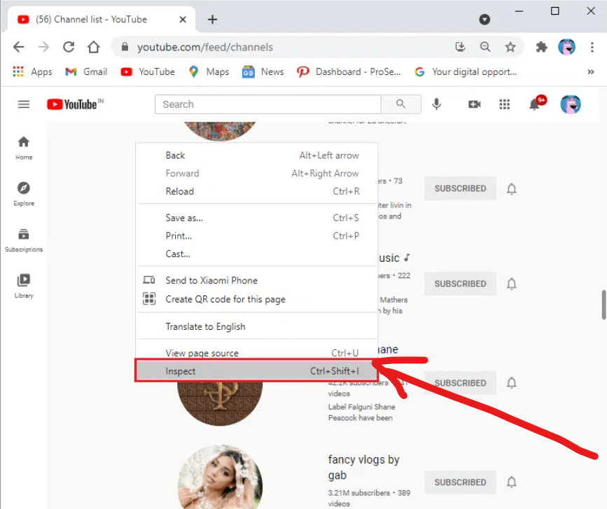
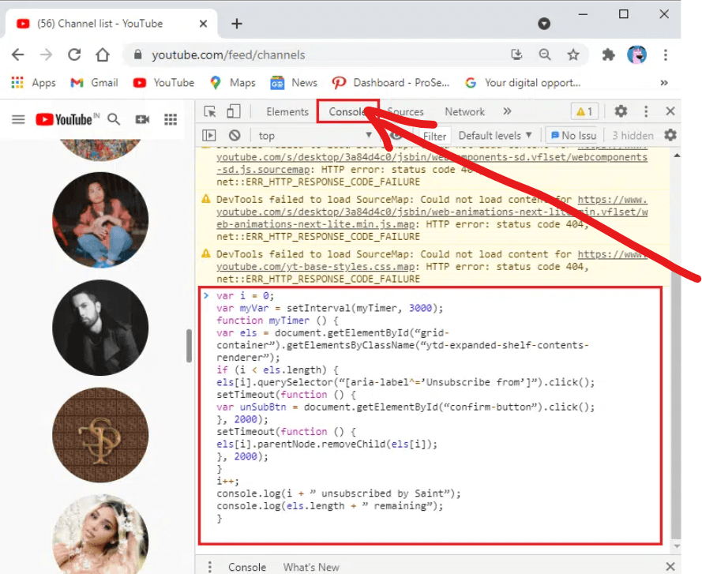

# unsubscribe_youtube-

unsubscribe youtube channel one click

1. Open any web browser on your desktop or laptop and open youtube.com

2. Navigate to Subscriptions > MANAGE.

3. A list of all the channels subscribed from your account will be displayed.

4. Scroll down till the end of the page and right-click anywhere on the empty space.

5. Select Inspect option.

  

6. A new window will appear on top of the bottom of the Manage Subscriptions page. Here, switch to the Console tab, which is the second tab in the list.

7. Copy-paste the given code in the console tab. Refer to pic below.

  

8. After pasting the above code into the console section, hit Enter and wait for the process to complete.

9. Finally, your subscriptions will start to disappear one-by-one.

Note: You may encounter errors while running the code in the console.

10. If the process slows down or gets stuck, refresh the page and rerun the code to mass unsubscribe the YouTube channels.
